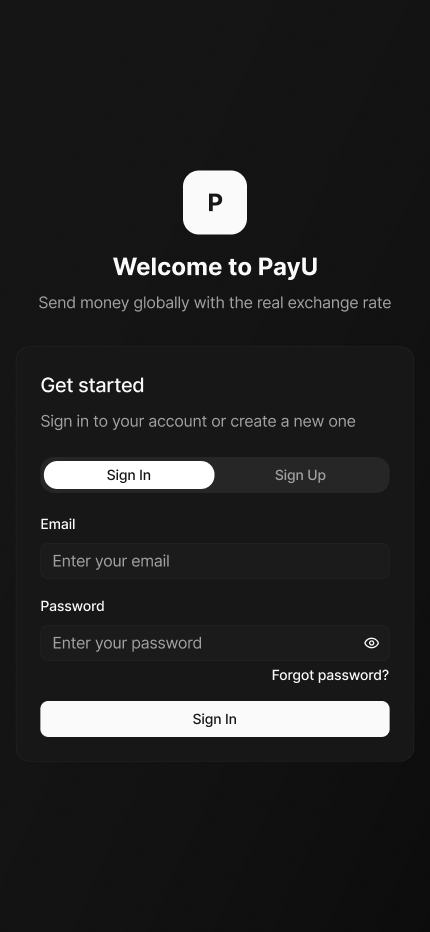
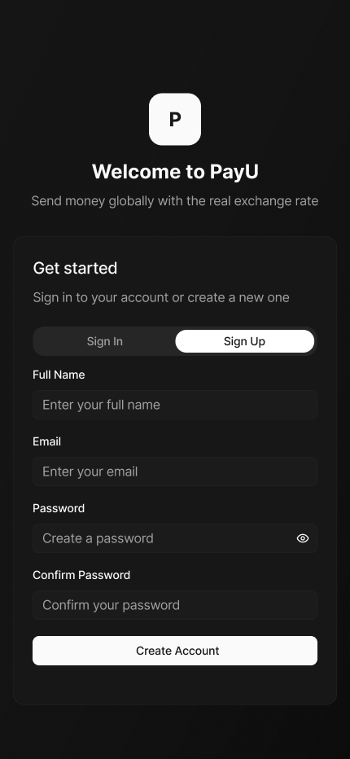
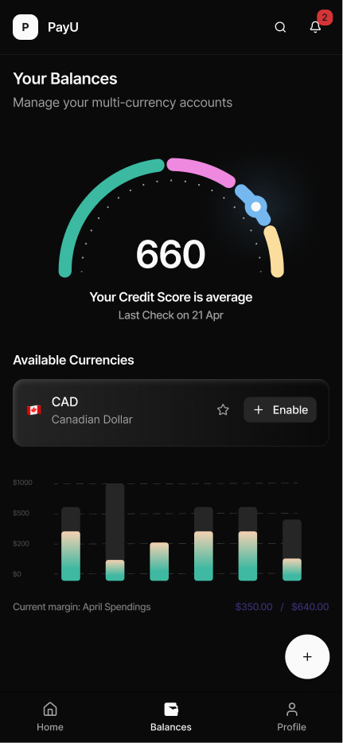

# Finance Manager / Expense Tracker

> A polished fintech-style mobile app for tracking income, expenses, balances, and smarter money habits.

This project was built for the Finance Manager App Assignment using Expo and React Native. It helps users add and manage transactions locally, review balance analytics, explore category-level spending, and use a clean multi-screen finance workflow with dark/light theme support.

## Overview

### Highlights

- mobile-first fintech UI with polished cards, gradients, and animations
- local-first finance tracking using AsyncStorage
- sign in / sign up flow for a cleaner app entry experience
- balance analytics screen with score gauge, donut chart, trend line, and custom bar chart
- searchable transactions, smart insights, undo delete, and profile editing

## Features

### Core Features

- Add income and expense transactions
- Transaction fields: amount, category, date, and note
- Form validation for transaction creation
- Category-based tracking with visual distinction
- Weekly, monthly, and yearly finance views
- Financial summary with available balance and expense visibility
- Local persistence using AsyncStorage
- Bottom tab navigation with 3 primary sections
- Dark, light, and system theme support
- Keyboard-aware forms for smoother mobile UX

### Standout Features

- Local sign in / sign up onboarding flow
- Smart insights card on the Home screen
- Search and filter on the balances/transactions screen
- Undo delete flow for removed transactions
- Spending by category donut chart
- Cash flow trend line chart
- Custom balance score gauge
- Animated entrances and polished empty states

## Tech Stack

- Expo
- React Native
- Expo Router
- Zustand
- AsyncStorage
- react-native-gifted-charts
- react-native-svg
- expo-linear-gradient
- lucide-react-native

## Project Structure

```text
app/
  auth.jsx
  add-transaction.jsx
  (tabs)/
    index.jsx
    transactions.jsx
    profile.jsx
src/
  components/
  store/
  theme/
assets/
```

## Setup Instructions

### 1. Clone the repository

```bash
git clone https://github.com/Gautammangesh/Finance-Manager-Assignment.git
cd Finance-Manager-Assignment
```

### 2. Install dependencies

```bash
npm install
```

### 3. Start the Expo development server

```bash
npx expo start
```

For a cleaner mobile connection flow:

```bash
npx expo start --clear --tunnel
```

### 4. Run on device

- Install Expo Go on your Android or iOS device
- Scan the QR code shown in the terminal

### 5. Demo login

Use the local demo credentials on the auth screen:

```text
Email: alex@tuf.com
Password: tuf12345
```

Or create a new local account through the Sign Up flow.

### 6. Run checks

```bash
npx tsc --noEmit
npm test -- --runInBand
npx expo-doctor
```

## Screenshots

### 1. Home Dashboard

Shows the TUF-branded home screen with wallet card, balance summary, smart insights, and recent transactions.


### 2. Auth Flow

Shows the local sign in / sign up experience before entering the app.




### 3. Add Transaction Flow

Shows the add income/expense form with amount, date, category, note, validation, and save action.


### 4. Balances & Analytics

Shows the custom balance score gauge, category donut chart, stacked spending bars, and cash flow trend line.



### 5. Search & Filter Transactions

Shows transaction search and filter controls for quickly finding income and expense entries.


### 6. Profile & Theme Settings

Shows profile preview/edit flow along with dark/light/system theme switching and sign out.


## Testing

The project has been validated with:

- TypeScript check via `npx tsc --noEmit`
- Jest tests via `npm test -- --runInBand`
- Expo environment validation via `npx expo-doctor`

Current automated coverage includes:

- adding transactions
- deleting transactions
- undo-related store restoration
- profile updates
- theme mode updates
- custom category creation
- local sign-in validation

## Assignment Requirements Mapping

### Mandatory Requirements

- Gradient-based UI: implemented
- Dark / Light mode toggle: implemented
- Bottom Tab Navigation: implemented
- Animations: implemented
- Keyboard handling: implemented
- Local storage: implemented

### Feature Requirements

- Add income / expense: implemented
- Fields: amount, category, date, note: implemented
- Form validation: implemented
- Category-based tracking: implemented
- Monthly summary: implemented

## Repository

GitHub Repo:

`https://github.com/Gautammangesh/Finance-Manager-Assignment`

## APK Build

This Expo project is configured for EAS APK builds.

1. Install EAS CLI:

```bash
npm install -g eas-cli
```

2. Log in to your Expo account:

```bash
eas login
```

3. Build a shareable Android APK:

```bash
eas build -p android --profile preview
```

4. After the build finishes, Expo will provide a public download URL.

Use that generated URL in the submission form's APK Link field.

## Author

Built by Mangesh for the Finance Manager App Assignment.
