# Finance Manager / Expense Tracker

> A polished fintech-style mobile app for tracking income, expenses, balances, analytics, and smarter money habits.

A modern fintech-style mobile app built for the Finance Manager App Assignment using Expo and React Native. The app helps users track income and expenses, monitor category-based spending, view financial summaries, explore balance analytics, and manage everything locally with a polished dark/light experience.

## Overview

### Why this project?

This project focuses on:
- clean mobile-first UI/UX
- scalable component structure
- local-first finance tracking
- thoughtful product polish beyond the minimum assignment requirements

The app includes the assignment core flows along with standout additions like a local auth flow, smart insights, transaction search/filter, undo delete, a custom balance gauge, donut analytics, and cash-flow trends.

## Complete App Flow

### 1. Auth Entry
- 🔐 Local `Sign In / Sign Up` flow before entering the app
- 👤 Demo-friendly onboarding for a smoother first experience
- ⌨️ Keyboard-aware auth form layout for mobile devices

### 2. Home Dashboard
- 💳 TUF Wallet overview card with available balance
- 📊 Summary cards for balance and spending snapshot
- ✨ Smart insight card that reacts to recent spending behaviour
- 🧾 Quick recent expenses list with polished transaction cards

### 3. Add Transaction
- 💸 Add income and expense transactions
- 📝 Fields for amount, category, date, and note
- ✅ Validation for clean and safe transaction creation

### 4. Balances & Analytics
- 🎯 Custom balance score gauge
- 🍩 Spending by category donut chart
- 📈 Cash flow trend line chart
- 📊 Spending pace bar chart across weekly, monthly, and yearly views
- 🔎 Search and filter support for transaction history

### 5. Profile & Settings
- 👤 Profile preview and edit flow
- 🌗 Dark, light, and system theme switching
- 🔁 Reset demo data support
- 🚪 Sign out support

## Features

### Core Features
- 💸 Add income and expense transactions
- 📝 Transaction fields: amount, category, date, and note
- ✅ Form validation for transaction creation
- 🏷️ Category-based tracking with icons and color distinction
- 📆 Weekly, monthly, and yearly finance views
- 📊 Financial summary with balance and expense visibility
- 💾 Local persistence using AsyncStorage
- 🧭 Bottom tab navigation with 3 primary sections
- 🌗 Dark, light, and system theme support
- 🎨 Gradient-based fintech-style UI
- ⌨️ Keyboard-aware forms for smoother mobile UX

### Standout Features
- 🔐 Local sign in / sign up onboarding flow
- ✨ Smart insights card on the Home screen
- 🔎 Search and filter on the balances screen
- ↩️ Undo delete flow for removed transactions
- 🍩 Spending by category donut chart
- 📈 Cash flow trend line chart
- 🎯 Custom balance score gauge
- 🎬 Animated entrances and micro-interactions
- 👻 Better empty states and polished visual hierarchy

## Tech Stack

- ⚡ Expo
- 📱 React Native
- 🧭 Expo Router
- 🗂️ Zustand
- 💾 AsyncStorage
- 📊 react-native-gifted-charts
- 🧩 react-native-svg
- 👆 react-native-gesture-handler
- 🌈 expo-linear-gradient
- 🎛️ lucide-react-native

## Project Structure

```text
app/
  auth.jsx
  add-transaction.jsx
  (tabs)/
    index.jsx
    transactions.jsx
    profile.jsx
src/
  components/
    BalanceGauge.jsx
    GradientBankCard.jsx
    SummaryCard.jsx
    StyledButton.jsx
    StyledInput.jsx
    TransactionItem.jsx
  store/
    useFinanceStore.js
  theme/
assets/
```

## Setup Instructions

### 1. Clone the repository

```bash
git clone https://github.com/Gautammangesh/Finance-Manager-Assignment.git
cd Finance-Manager-Assignment
```

### 2. Install dependencies

```bash
npm install
```

### 3. Start the Expo development server

```bash
npx expo start
```

If you want a cleaner mobile connection flow, you can also use:

```bash
npx expo start --clear --tunnel
```

### 4. Run on device

- 📲 Install Expo Go on your Android or iOS device
- 🔍 Scan the QR code shown in the terminal

### 5. Demo Auth Credentials

You can log in with the local demo account:

```text
Email: gautammanoj767@gmail.com
Password: mangesh12345
```

Or create your own account using the Sign Up flow.

### 6. Run checks

```bash
npx tsc --noEmit
npm test -- --runInBand
npx expo-doctor
```

## Screenshots

### 1. Home Dashboard
Shows the TUF-branded home screen with wallet card, balance summary, smart insights card, and recent transactions.

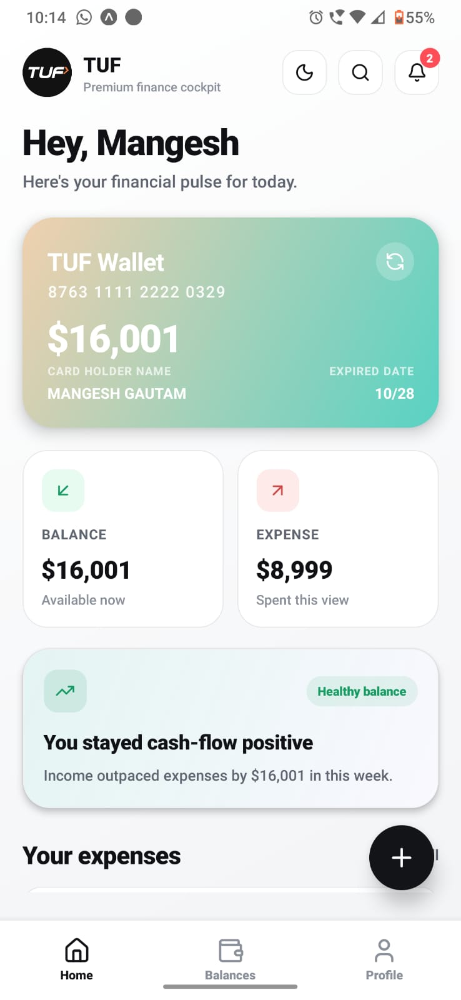

### 2. Auth Flow
Shows the local sign in and sign up experience before entering the app.

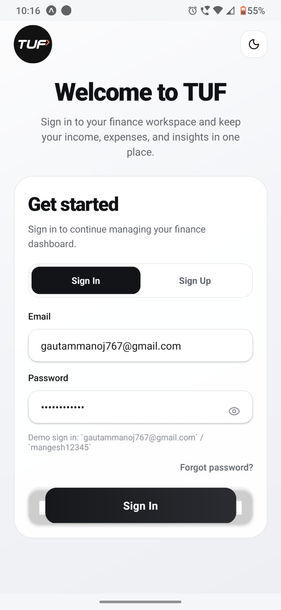
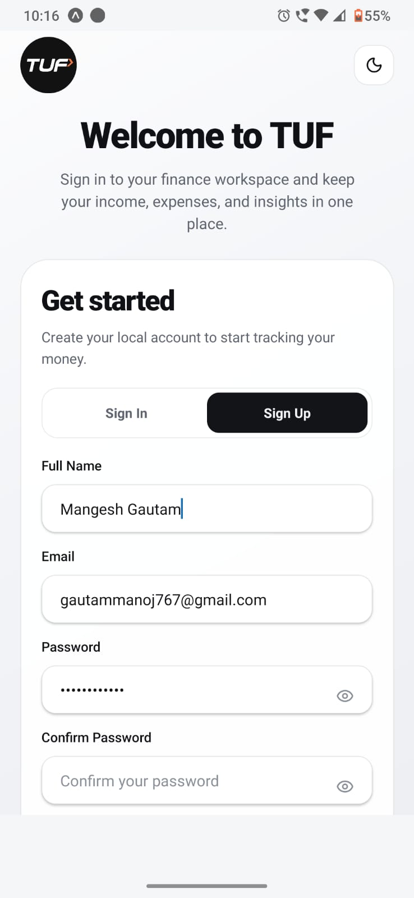

### 3. Balances & Analytics
Shows the custom score gauge, donut chart, spending pace bars, and cash flow trend chart.

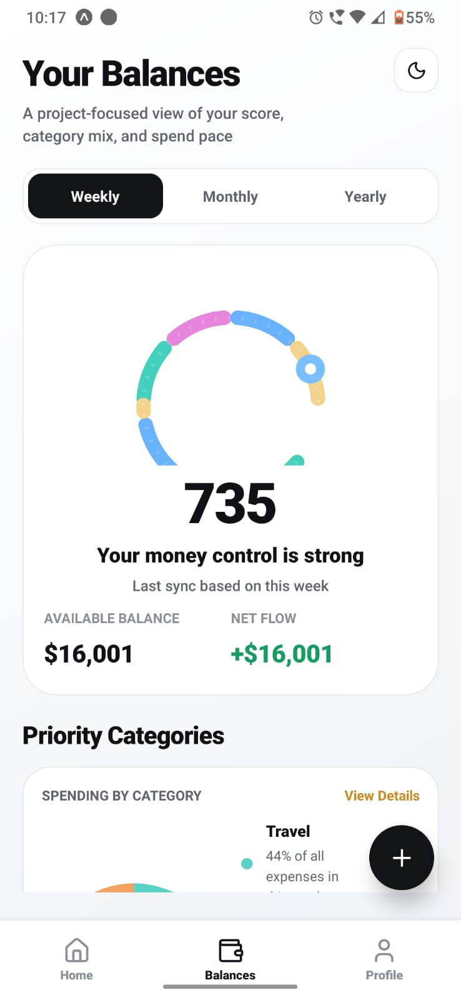

### 4. Add Transaction Flow
Shows the add income/expense form with amount, date, category, note, validation, and save action.

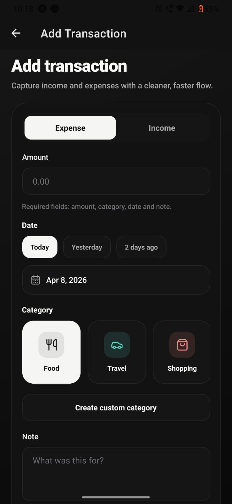

### 5. Search & Filter Transactions
Shows transaction search and filter controls for quickly finding income and expense entries.

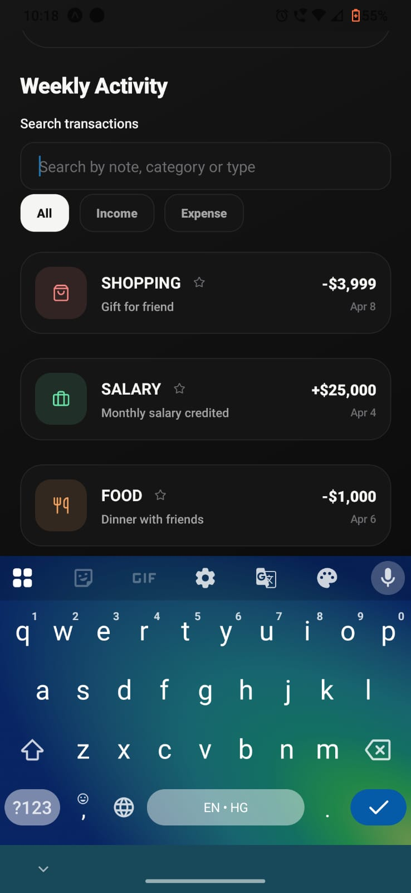

### 6. Profile & Theme Settings
Shows profile preview/edit flow along with dark/light/system theme switching and sign out.

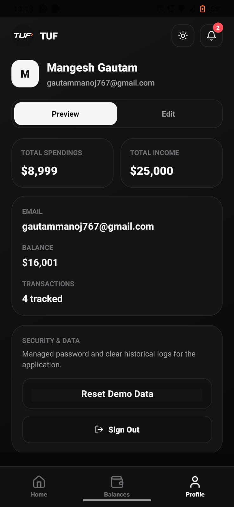

### 7. Smart Insights Card
Shows the insight card that reacts to spending behavior and recent activity.

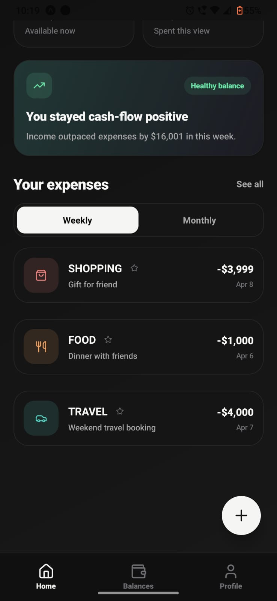

### 8. Category Breakdown
Shows the category donut chart and expense distribution view.

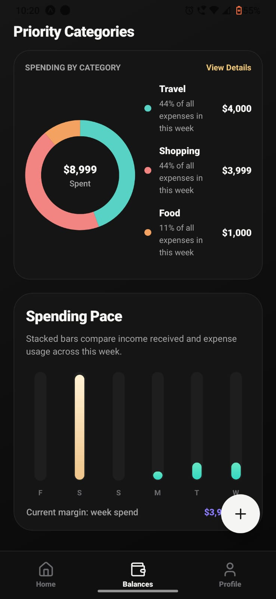

### 9. Cash Flow Trend
Shows the trend chart for income versus expense movement over time.

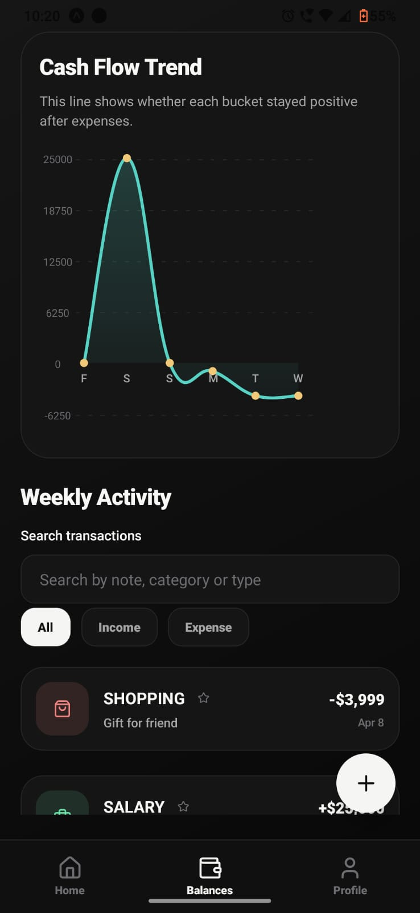

### 10. Spending Pace Chart
Shows the bar chart for weekly, monthly, or yearly spending pace.

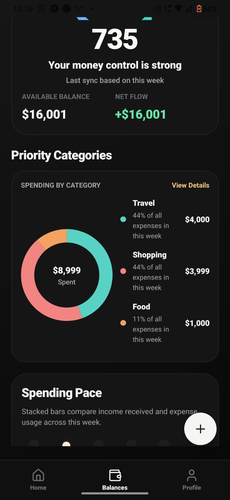

## Testing

The project has been validated with:
- 🧪 TypeScript check via `npx tsc --noEmit`
- ✅ Jest tests via `npm test -- --runInBand`
- 🩺 Expo environment validation via `npx expo-doctor`

Current automated coverage includes:
- adding transactions
- deleting transactions
- undo-related store restoration
- profile updates
- theme mode updates
- custom category creation
- local sign-in validation

## Assignment Requirements Mapping

### Mandatory Requirements
- 🎨 Gradient-based UI: implemented
- 🌗 Dark / Light mode toggle: implemented
- 🧭 Bottom Tab Navigation: implemented
- 🎬 Animations: implemented
- ⌨️ Keyboard handling: implemented
- 💾 Local storage: implemented

### Feature Requirements
- 💸 Add income / expense: implemented
- 📝 Fields: amount, category, date, note: implemented
- ✅ Form validation: implemented
- 🏷️ Category-based tracking: implemented
- 📊 Monthly summary: implemented

## Repository

GitHub Repo:

`https://github.com/Gautammangesh/Finance-Manager-Assignment`

## APK Build

This Expo project is configured for EAS APK builds.

1. Install EAS CLI:

```bash
npm install -g eas-cli
```

2. Log in to your Expo account:

```bash
eas login
```

3. Build a shareable Android APK:

```bash
eas build -p android --profile preview
```

4. After the build finishes, Expo will give you a public download URL.

Use that generated URL in the submission form's APK Link field.

## Notes

- The app uses local persistence only and does not require a backend.
- Auth in this project is local/demo-oriented and designed for assignment presentation.
- The current repo includes the available screenshots inside the `screenshots/` folder.
- You can later add more screenshots by dropping files into the `screenshots/` folder using the names referenced above.

## Author

Built by Mangesh for the Finance Manager App Assignment.
